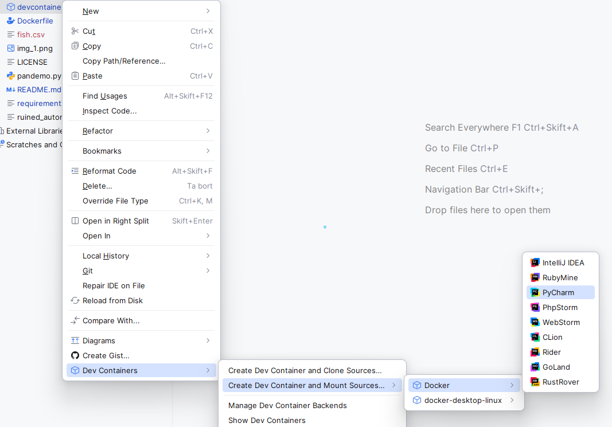
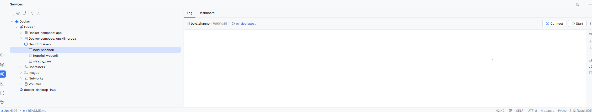

## Local work environment Demo

A rundown on how to configure and build a local, common development environment for any 
repo based on the same container and then expanded with the repo's own requirements.

### Step1.
*In terminal:*

`docker pull python:3.10.15-slim` 

or similar base image - **UPDATE Dockerfile accordingly** 

`docker build -t "py-dev:dash_app_v1" .`

add/replace version numbers as needed after py-dev like: `py-dev:your_project_v*x*`

### Step 2.
Now make sure your `devcontainer.json` contains the same image name as above, with exact 
version. 

### Step 3.
Select the `devcontainer.json` file, right-click and select the option: 
> Dev Containers > Create Dev Container and Mount Sources.

This needs your git repo and the branch used to build and creates a new image with your IDE-backend connected.
When this is up and running you can connect and it opens in a new IDE-window running in 
your container. This might need a venv to be initiated from your requirements, 
but your image is built with exactly those and should contain just what you need to initalize a new venv.

### Step 4. 
Start your new container in your Services and Connect

### Step 5.
A new window with PyCharm and your environment should open and this is now running in Docker.
Develop, test and commit as needed. The environment should be connected to your upstream.
